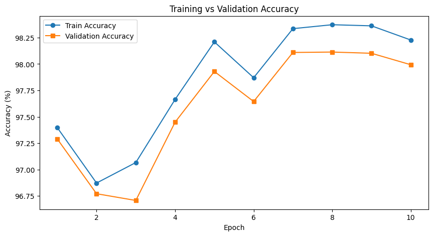
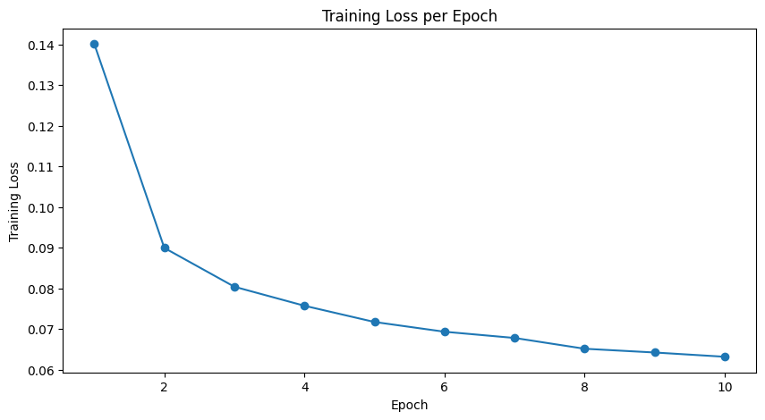
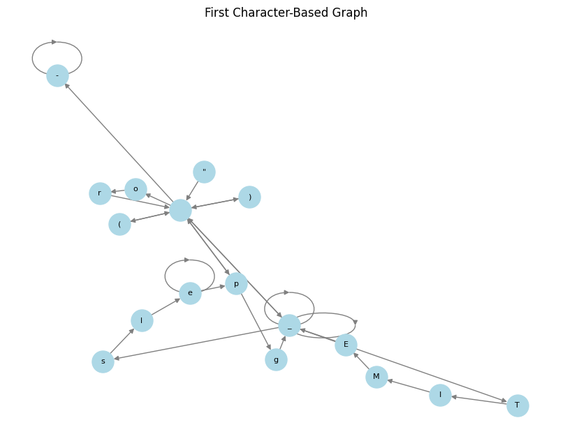
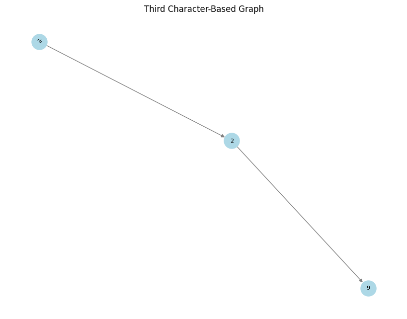
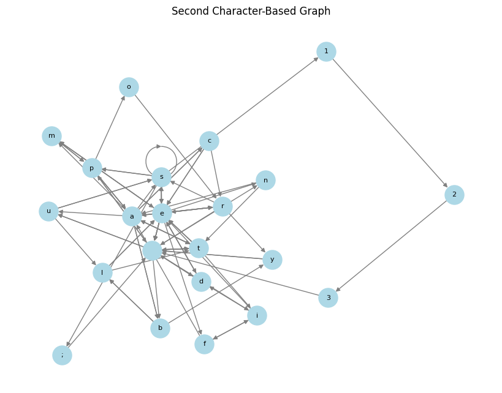
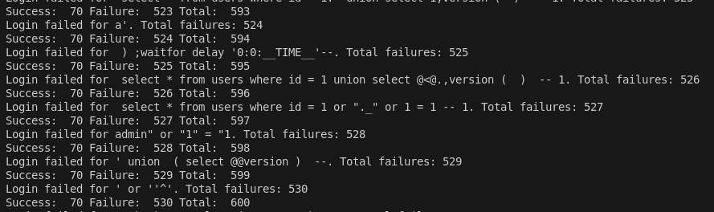
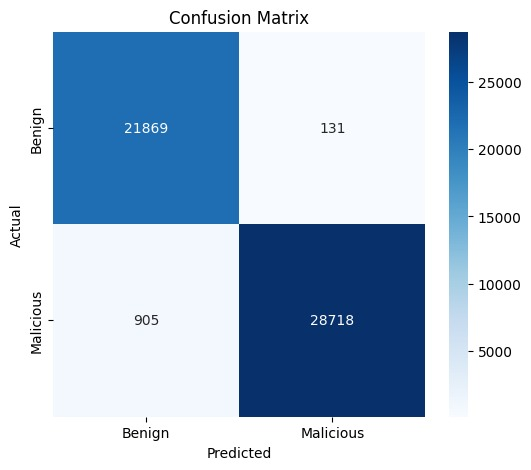
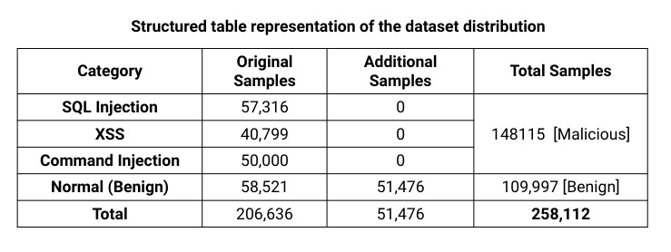

# 🛡️ Web Injection Detector – GCN-based Model  
*M.Tech (Cyber Security) – Semester (II) Minor Project*  

---

## ⚙️ Tech Stack  
  
  
  
  
  

📊 **Languages Used**  
  
  
  

---

## 👨‍💻 Contributors
-   
-   
-   

---

## 📖 Overview
This project implements a **Graph Convolutional Network (GCN)-based approach** for detecting **Web Injection Attacks** at the **Web Application Firewall (WAF)** level.  

By converting web payloads into **graph-based representations**, the model achieves superior **pattern recognition** and detection of **obfuscated/adversarial payloads**.  

> 🛡️ **Goal**: Strengthen WAFs using **deep learning** beyond traditional signature-based rules.  

---

## 🎯 Target Attacks
- 🐍 **SQL Injection (SQLi)**  
- 🌐 **Cross-Site Scripting (XSS)**  
- 💻 **Command Injection**  

---

## 🏗️ Model Architecture
📌 **Key Components**  
- 🔹 Multi-layer **Graph Convolutional Network (GCN)**  
- 🔹 **Batch Normalization** & **Dropout**  
- 🔹 Fully-connected **classification layers**  
- 🔹 **Character-level tokenization**  

---

## 📊 Model Training Performance  

### 📈 Training vs Validation Accuracy

### 📉 Training Loss

---

## 🕸️ Character-Based Graph Representations  

### 🧩 Graph Construction Examples
  
  

---

## 🖥️ Attack Detection Logs  

### ⚔️ Attack Detection Logs

---

## ✅ Evaluation Metrics  

### 🔎 Confusion Matrix

---

## 📂 Dataset Distribution  

### 📊 Dataset Distribution

---

## 💡 Key Insights
✅ **Strengths**  
- Learns **relational patterns** in payloads  
- Resistant to **obfuscation & bypass**  
- Excellent detection of **SQL Injection**  

⚠️ **Limitations**  
- Dataset imbalance → weaker for **XSS & Command Injection**  
- **Higher compute** vs rule-based detection  
- Lower **interpretability** than signature-based WAFs  

---

## 📚 References
-   
-   
-   

---

## 🚀 Future Work
- ⚖️ Balance **XSS & Command Injection** datasets  
- 🔤 Explore **embeddings** for richer tokenization  
- 🌍 Collect **real-world malicious/benign traffic**  
- 🔧 Tune **hyperparameters** for peak accuracy  
- 🛡️ Deploy in **production WAF pipelines**  

---

## 📌 Project Status
✅ Completed – **M.Tech Semester II Minor Project**  
🌐 Domain: **Web Security – Injection Attack Detection**  
